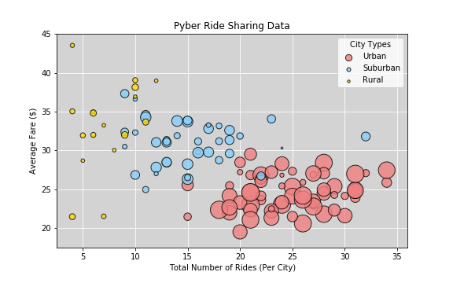
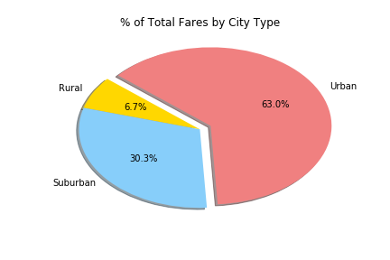
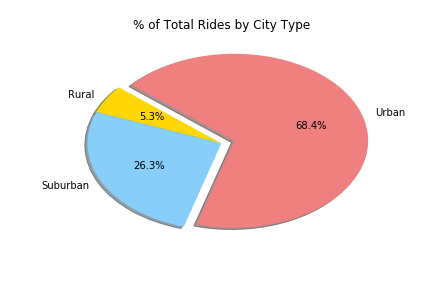
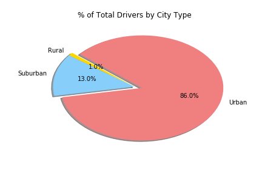

# Observable Trends
###### 1. The ride sharing data bubble chart shows distinct differences between urban, suburban, and rural city types. It seems less densely populated cities have higher average fares than those with a higher population (more people, lower average fare).
###### 2. According to the Pyber data, urban cities contributed to 63% of the total fares while suburban and rural contributed to 30.3% and 6.7% respectively.
###### 3. Cities with higher populations tend to have more rides and drivers than cities with lower populations.


```python
# Import dependencies
import pandas as pd
import numpy as np
import matplotlib.pyplot as plt
```


```python
# Set csv paths
city_path = 'raw_data/city_data.csv'
ride_path = 'raw_data/ride_data.csv'
```


```python
# Read city csv
city_df = pd.read_csv(city_path)
city_df = city_df.sort_values(by='city')
city_df.head()
```


<div>
<style>
    .dataframe thead tr:only-child th {
        text-align: right;
    }

    .dataframe thead th {
        text-align: left;
    }

    .dataframe tbody tr th {
        vertical-align: top;
    }
</style>
<table border="1" class="dataframe">
  <thead>
    <tr style="text-align: right;">
      <th></th>
      <th>city</th>
      <th>driver_count</th>
      <th>type</th>
    </tr>
  </thead>
  <tbody>
    <tr>
      <th>65</th>
      <td>Alvarezhaven</td>
      <td>21</td>
      <td>Urban</td>
    </tr>
    <tr>
      <th>18</th>
      <td>Alyssaberg</td>
      <td>67</td>
      <td>Urban</td>
    </tr>
    <tr>
      <th>94</th>
      <td>Anitamouth</td>
      <td>16</td>
      <td>Suburban</td>
    </tr>
    <tr>
      <th>53</th>
      <td>Antoniomouth</td>
      <td>21</td>
      <td>Urban</td>
    </tr>
    <tr>
      <th>43</th>
      <td>Aprilchester</td>
      <td>49</td>
      <td>Urban</td>
    </tr>
  </tbody>
</table>
</div>


```python
# Show duplicate cities, will combine later with groupby and .sum()
city_df[city_df['city'].duplicated(keep=False)]
```


<div>
<style>
    .dataframe thead tr:only-child th {
        text-align: right;
    }

    .dataframe thead th {
        text-align: left;
    }

    .dataframe tbody tr th {
        vertical-align: top;
    }
</style>
<table border="1" class="dataframe">
  <thead>
    <tr style="text-align: right;">
      <th></th>
      <th>city</th>
      <th>driver_count</th>
      <th>type</th>
    </tr>
  </thead>
  <tbody>
    <tr>
      <th>84</th>
      <td>Port James</td>
      <td>15</td>
      <td>Suburban</td>
    </tr>
    <tr>
      <th>100</th>
      <td>Port James</td>
      <td>3</td>
      <td>Suburban</td>
    </tr>
  </tbody>
</table>
</div>


```python
# Group by city to consolidate Port James
group_city = city_df.groupby(['city'])

# Grab driver count sum for each city
driver_count = group_city['driver_count'].sum()

# Create data city dataframe
unique_city_df = pd.DataFrame({'driver_count': driver_count})

# Reset index
unique_city_df = unique_city_df.reset_index()
unique_city_df.count()
```


    city            125
    driver_count    125
    dtype: int64


```python
# Merge to add city type to unique city dataframe, but then need to drop duplicate city
new_city_df = pd.merge(unique_city_df, city_df, on='city')

# Drop driver count column from city df (driver_count_y)
new_city_df = new_city_df[['city', 'driver_count_x', 'type']]

# Rename driver_count_x column
new_city_df = new_city_df.rename(columns={'driver_count_x': 'driver_count'})
new_city_df.count()
```


    city            126
    driver_count    126
    type            126
    dtype: int64


```python
# Check duplicate city
new_city_df[new_city_df['city'].duplicated(keep=False)]
```


<div>
<style>
    .dataframe thead tr:only-child th {
        text-align: right;
    }

    .dataframe thead th {
        text-align: left;
    }

    .dataframe tbody tr th {
        vertical-align: top;
    }
</style>
<table border="1" class="dataframe">
  <thead>
    <tr style="text-align: right;">
      <th></th>
      <th>city</th>
      <th>driver_count</th>
      <th>type</th>
    </tr>
  </thead>
  <tbody>
    <tr>
      <th>72</th>
      <td>Port James</td>
      <td>18</td>
      <td>Suburban</td>
    </tr>
    <tr>
      <th>73</th>
      <td>Port James</td>
      <td>18</td>
      <td>Suburban</td>
    </tr>
  </tbody>
</table>
</div>


```python
# Drop duplicate city
new_city_df = new_city_df.drop_duplicates('city', keep='first')
new_city_df.count()
```


    city            125
    driver_count    125
    type            125
    dtype: int64


```python
# Read ride csv
ride_df = pd.read_csv(ride_path)
ride_df.head()
```


<div>
<style>
    .dataframe thead tr:only-child th {
        text-align: right;
    }

    .dataframe thead th {
        text-align: left;
    }

    .dataframe tbody tr th {
        vertical-align: top;
    }
</style>
<table border="1" class="dataframe">
  <thead>
    <tr style="text-align: right;">
      <th></th>
      <th>city</th>
      <th>date</th>
      <th>fare</th>
      <th>ride_id</th>
    </tr>
  </thead>
  <tbody>
    <tr>
      <th>0</th>
      <td>Sarabury</td>
      <td>2016-01-16 13:49:27</td>
      <td>38.35</td>
      <td>5403689035038</td>
    </tr>
    <tr>
      <th>1</th>
      <td>South Roy</td>
      <td>2016-01-02 18:42:34</td>
      <td>17.49</td>
      <td>4036272335942</td>
    </tr>
    <tr>
      <th>2</th>
      <td>Wiseborough</td>
      <td>2016-01-21 17:35:29</td>
      <td>44.18</td>
      <td>3645042422587</td>
    </tr>
    <tr>
      <th>3</th>
      <td>Spencertown</td>
      <td>2016-07-31 14:53:22</td>
      <td>6.87</td>
      <td>2242596575892</td>
    </tr>
    <tr>
      <th>4</th>
      <td>Nguyenbury</td>
      <td>2016-07-09 04:42:44</td>
      <td>6.28</td>
      <td>1543057793673</td>
    </tr>
  </tbody>
</table>
</div>


```python
# Check ride dataframe column counts
ride_df.count()
```


    city       2375
    date       2375
    fare       2375
    ride_id    2375
    dtype: int64


```python
# Merge by left join
pyber_df = pd.merge(ride_df, city_df, how='left')
pyber_df.count()
```


    city            2407
    date            2407
    fare            2407
    ride_id         2407
    driver_count    2407
    type            2407
    dtype: int64


```python
# Group by ride id
group_id = pyber_df.groupby(['ride_id'])

# Add driver count for duplicate city (Port James)
driver_count = group_id['driver_count'].sum()

# Create data city dataframe
unique_id = pd.DataFrame({'driver_count': driver_count})

# Reset index
unique_id = unique_id.reset_index()
unique_id.count()
```


    ride_id         2375
    driver_count    2375
    dtype: int64


```python
# Observe dataframe
unique_id.head()
```


<div>
<style>
    .dataframe thead tr:only-child th {
        text-align: right;
    }

    .dataframe thead th {
        text-align: left;
    }

    .dataframe tbody tr th {
        vertical-align: top;
    }
</style>
<table border="1" class="dataframe">
  <thead>
    <tr style="text-align: right;">
      <th></th>
      <th>ride_id</th>
      <th>driver_count</th>
    </tr>
  </thead>
  <tbody>
    <tr>
      <th>0</th>
      <td>2238752751</td>
      <td>4</td>
    </tr>
    <tr>
      <th>1</th>
      <td>7522667629</td>
      <td>19</td>
    </tr>
    <tr>
      <th>2</th>
      <td>11622863980</td>
      <td>27</td>
    </tr>
    <tr>
      <th>3</th>
      <td>12105457917</td>
      <td>3</td>
    </tr>
    <tr>
      <th>4</th>
      <td>18075235678</td>
      <td>66</td>
    </tr>
  </tbody>
</table>
</div>


```python
# Drop duplicates from pyber dataframe, preserving columns for merge on ride id
drop_dup_pyber = pyber_df.drop_duplicates('ride_id', keep='first')
drop_dup_pyber.count()
```


    city            2375
    date            2375
    fare            2375
    ride_id         2375
    driver_count    2375
    type            2375
    dtype: int64


```python
# Merge on ride
merge_pyber = pd.merge(unique_id, drop_dup_pyber, on='ride_id')

# Reorder columns and drop incorrect driver count column (driver_count_y)
clean_pyber = merge_pyber.iloc[:, [2, 3, 4, 1, 0, 6]]

# Rename driver count column
clean_pyber = clean_pyber.rename(columns={'driver_count_x': 'driver_count'})
clean_pyber.head()
```


<div>
<style>
    .dataframe thead tr:only-child th {
        text-align: right;
    }

    .dataframe thead th {
        text-align: left;
    }

    .dataframe tbody tr th {
        vertical-align: top;
    }
</style>
<table border="1" class="dataframe">
  <thead>
    <tr style="text-align: right;">
      <th></th>
      <th>city</th>
      <th>date</th>
      <th>fare</th>
      <th>driver_count</th>
      <th>ride_id</th>
      <th>type</th>
    </tr>
  </thead>
  <tbody>
    <tr>
      <th>0</th>
      <td>West Evan</td>
      <td>2016-02-03 15:50:57</td>
      <td>17.57</td>
      <td>4</td>
      <td>2238752751</td>
      <td>Suburban</td>
    </tr>
    <tr>
      <th>1</th>
      <td>South Gracechester</td>
      <td>2016-09-08 06:53:25</td>
      <td>23.25</td>
      <td>19</td>
      <td>7522667629</td>
      <td>Suburban</td>
    </tr>
    <tr>
      <th>2</th>
      <td>Port Alexandria</td>
      <td>2016-08-10 12:16:09</td>
      <td>31.75</td>
      <td>27</td>
      <td>11622863980</td>
      <td>Suburban</td>
    </tr>
    <tr>
      <th>3</th>
      <td>Kennethburgh</td>
      <td>2016-02-29 21:50:59</td>
      <td>47.48</td>
      <td>3</td>
      <td>12105457917</td>
      <td>Rural</td>
    </tr>
    <tr>
      <th>4</th>
      <td>Lisaville</td>
      <td>2016-09-30 22:29:40</td>
      <td>31.06</td>
      <td>66</td>
      <td>18075235678</td>
      <td>Urban</td>
    </tr>
  </tbody>
</table>
</div>


# Bubble Plot of Ride Sharing Data


```python
# Group by city
group_city = clean_pyber.groupby(['city'])

# Grab mean fare for each city
avg_fare = group_city['fare'].mean()

# Grab count of rides for each city
total_ride = group_city['ride_id'].count()

# Create dataframe from group by object
fare_ride = pd.DataFrame({'avg_fare': avg_fare, 'total_ride_count': total_ride})

# Reset index
fare_ride = fare_ride.reset_index()
fare_ride.head()
```


<div>
<style>
    .dataframe thead tr:only-child th {
        text-align: right;
    }

    .dataframe thead th {
        text-align: left;
    }

    .dataframe tbody tr th {
        vertical-align: top;
    }
</style>
<table border="1" class="dataframe">
  <thead>
    <tr style="text-align: right;">
      <th></th>
      <th>city</th>
      <th>avg_fare</th>
      <th>total_ride_count</th>
    </tr>
  </thead>
  <tbody>
    <tr>
      <th>0</th>
      <td>Alvarezhaven</td>
      <td>23.928710</td>
      <td>31</td>
    </tr>
    <tr>
      <th>1</th>
      <td>Alyssaberg</td>
      <td>20.609615</td>
      <td>26</td>
    </tr>
    <tr>
      <th>2</th>
      <td>Anitamouth</td>
      <td>37.315556</td>
      <td>9</td>
    </tr>
    <tr>
      <th>3</th>
      <td>Antoniomouth</td>
      <td>23.625000</td>
      <td>22</td>
    </tr>
    <tr>
      <th>4</th>
      <td>Aprilchester</td>
      <td>21.981579</td>
      <td>19</td>
    </tr>
  </tbody>
</table>
</div>


```python
# Merge with new city df
city_summary = pd.merge(fare_ride, new_city_df, how='left')
city_summary.count()
```


    city                125
    avg_fare            125
    total_ride_count    125
    driver_count        125
    type                125
    dtype: int64


```python
# Set index to city type
city_summary = city_summary.set_index(['type'])
city_summary.head()
```


<div>
<style>
    .dataframe thead tr:only-child th {
        text-align: right;
    }

    .dataframe thead th {
        text-align: left;
    }

    .dataframe tbody tr th {
        vertical-align: top;
    }
</style>
<table border="1" class="dataframe">
  <thead>
    <tr style="text-align: right;">
      <th></th>
      <th>city</th>
      <th>avg_fare</th>
      <th>total_ride_count</th>
      <th>driver_count</th>
    </tr>
    <tr>
      <th>type</th>
      <th></th>
      <th></th>
      <th></th>
      <th></th>
    </tr>
  </thead>
  <tbody>
    <tr>
      <th>Urban</th>
      <td>Alvarezhaven</td>
      <td>23.928710</td>
      <td>31</td>
      <td>21</td>
    </tr>
    <tr>
      <th>Urban</th>
      <td>Alyssaberg</td>
      <td>20.609615</td>
      <td>26</td>
      <td>67</td>
    </tr>
    <tr>
      <th>Suburban</th>
      <td>Anitamouth</td>
      <td>37.315556</td>
      <td>9</td>
      <td>16</td>
    </tr>
    <tr>
      <th>Urban</th>
      <td>Antoniomouth</td>
      <td>23.625000</td>
      <td>22</td>
      <td>21</td>
    </tr>
    <tr>
      <th>Urban</th>
      <td>Aprilchester</td>
      <td>21.981579</td>
      <td>19</td>
      <td>49</td>
    </tr>
  </tbody>
</table>
</div>


```python
# Subset city summary by type
urban_df = city_summary.loc['Urban', ['avg_fare', 'total_ride_count', 'driver_count']]
suburb_df = city_summary.loc['Suburban', ['avg_fare', 'total_ride_count', 'driver_count']]
rural_df = city_summary.loc['Rural', ['avg_fare', 'total_ride_count', 'driver_count']]
```


```python
# Assign bubble x axes
urban_x = urban_df['total_ride_count']
suburb_x = suburb_df['total_ride_count']
rural_x = rural_df['total_ride_count']

# Assign bubble y axes
urban_y = urban_df['avg_fare']
suburb_y = suburb_df['avg_fare']
rural_y = rural_df['avg_fare']

# Assign bubble sizes
urban_s = urban_df['driver_count']*7
suburb_s = suburb_df['driver_count']*7
rural_s = rural_df['driver_count']*7

# Set figure size
plt.figure(figsize=(8, 5))

# Create scatter plots
urban = plt.scatter(urban_x, urban_y, marker="o", facecolors="lightcoral", edgecolors="black", s=urban_s, 
                    alpha=0.8, label="Urban")
suburb = plt.scatter(suburb_x, suburb_y, marker="o", facecolors="lightskyblue", edgecolors="black", s=suburb_s, 
                     alpha=0.8, label="Suburban")
rural = plt.scatter(rural_x, rural_y, marker="o", facecolors="gold", edgecolors="black", s=rural_s, 
                    alpha=0.8, label="Rural")

# Set the upper and lower limits of our axes
plt.xlim(2.5,36)
plt.ylim(17.5, 45)

# Create chart title, x label, and y label
plt.title("Pyber Ride Sharing Data")
plt.xlabel("Total Number of Rides (Per City)")
plt.ylabel("Average Fare ($)")

# Set legend
legend = plt.legend(title='City Types', loc='best', markerscale=.5)

# Set axes background color
ax = plt.gca()
ax.set_facecolor('lightgray')

# Insert grid lines and set behind plot elements
ax.grid(color='white')
ax.set_axisbelow(True)
```


```python
# Pyber Ride Sharing Data
plt.savefig('Images/pyberRideSharing.png')
plt.show()
```





# Total Fares by City Type


```python
clean_pyber.head()
```


<div>
<style>
    .dataframe thead tr:only-child th {
        text-align: right;
    }

    .dataframe thead th {
        text-align: left;
    }

    .dataframe tbody tr th {
        vertical-align: top;
    }
</style>
<table border="1" class="dataframe">
  <thead>
    <tr style="text-align: right;">
      <th></th>
      <th>city</th>
      <th>date</th>
      <th>fare</th>
      <th>driver_count</th>
      <th>ride_id</th>
      <th>type</th>
    </tr>
  </thead>
  <tbody>
    <tr>
      <th>0</th>
      <td>West Evan</td>
      <td>2016-02-03 15:50:57</td>
      <td>17.57</td>
      <td>4</td>
      <td>2238752751</td>
      <td>Suburban</td>
    </tr>
    <tr>
      <th>1</th>
      <td>South Gracechester</td>
      <td>2016-09-08 06:53:25</td>
      <td>23.25</td>
      <td>19</td>
      <td>7522667629</td>
      <td>Suburban</td>
    </tr>
    <tr>
      <th>2</th>
      <td>Port Alexandria</td>
      <td>2016-08-10 12:16:09</td>
      <td>31.75</td>
      <td>27</td>
      <td>11622863980</td>
      <td>Suburban</td>
    </tr>
    <tr>
      <th>3</th>
      <td>Kennethburgh</td>
      <td>2016-02-29 21:50:59</td>
      <td>47.48</td>
      <td>3</td>
      <td>12105457917</td>
      <td>Rural</td>
    </tr>
    <tr>
      <th>4</th>
      <td>Lisaville</td>
      <td>2016-09-30 22:29:40</td>
      <td>31.06</td>
      <td>66</td>
      <td>18075235678</td>
      <td>Urban</td>
    </tr>
  </tbody>
</table>
</div>


```python
# Group by type
group_type = clean_pyber.groupby(['type'])

# Grab sum of fares
total_fare = group_type['fare'].sum()

# Create dataframe
fares_by_type = pd.DataFrame({'total_fare': total_fare})

# Reset index
fares_by_type = fares_by_type.reset_index()
fares_by_type
```


<div>
<style>
    .dataframe thead tr:only-child th {
        text-align: right;
    }

    .dataframe thead th {
        text-align: left;
    }

    .dataframe tbody tr th {
        vertical-align: top;
    }
</style>
<table border="1" class="dataframe">
  <thead>
    <tr style="text-align: right;">
      <th></th>
      <th>type</th>
      <th>total_fare</th>
    </tr>
  </thead>
  <tbody>
    <tr>
      <th>0</th>
      <td>Rural</td>
      <td>4255.09</td>
    </tr>
    <tr>
      <th>1</th>
      <td>Suburban</td>
      <td>19317.88</td>
    </tr>
    <tr>
      <th>2</th>
      <td>Urban</td>
      <td>40078.34</td>
    </tr>
  </tbody>
</table>
</div>


```python
# Labels for the sections
labels = fares_by_type['type']

# Values of each section
sizes = fares_by_type['total_fare']

# Colors for the city types
colors = ["gold", "lightskyblue", "lightcoral"]

# Explode on "Urban" section
explode = (0, 0, 0.1)
```


```python
# Create pie chart
plt.pie(sizes, explode=explode, labels=labels, colors=colors,
        autopct="%1.1f%%", shadow=True, startangle=140)

# Label title
plt.title("% of Total Fares by City Type")

# Have equal axes
# plt.axis("equal")
```


    Text(0.5,1,'% of Total Fares by City Type')


```python
# % of Total Fares by City Type
plt.savefig('Images/totalFaresbyType.png')
plt.show()
```





# Total Rides by City Type


```python
# Group by type
group_type = clean_pyber.groupby(['type'])

# Grab count of rides
total_rides = group_type['ride_id'].count()

# Create dataframe
rides_by_type = pd.DataFrame({'total_rides': total_rides})

# Reset index
rides_by_type = rides_by_type.reset_index()
rides_by_type
```


<div>
<style>
    .dataframe thead tr:only-child th {
        text-align: right;
    }

    .dataframe thead th {
        text-align: left;
    }

    .dataframe tbody tr th {
        vertical-align: top;
    }
</style>
<table border="1" class="dataframe">
  <thead>
    <tr style="text-align: right;">
      <th></th>
      <th>type</th>
      <th>total_rides</th>
    </tr>
  </thead>
  <tbody>
    <tr>
      <th>0</th>
      <td>Rural</td>
      <td>125</td>
    </tr>
    <tr>
      <th>1</th>
      <td>Suburban</td>
      <td>625</td>
    </tr>
    <tr>
      <th>2</th>
      <td>Urban</td>
      <td>1625</td>
    </tr>
  </tbody>
</table>
</div>


```python
# Labels for the sections
labels = rides_by_type['type']

# Values of each section
sizes = rides_by_type['total_rides']

# Colors for the city types
colors = ["gold", "lightskyblue", "lightcoral"]

# Explode on "Urban" section
explode = (0, 0, 0.1)
```


```python
# Create pie chart
plt.pie(sizes, explode=explode, labels=labels, colors=colors,
        autopct="%1.1f%%", shadow=True, startangle=140)

# Label title
plt.title("% of Total Rides by City Type")

# Set equal axes
# plt.axis("equal")
```


    Text(0.5,1,'% of Total Rides by City Type')


```python
# % of Total Rides by City Type
plt.savefig('Images/totalRidesbyType.png')
plt.show()
```





# Total Drivers by City Type


```python
# Group by city type
group_city = clean_pyber.groupby(['type'])

# Grab sum of drivers
total_drivers = group_city['driver_count'].sum()

# Create dataframe
drivers_by_type = pd.DataFrame({'total_drivers': total_drivers})

# Reset index
drivers_by_type = drivers_by_type.reset_index()
drivers_by_type
```


<div>
<style>
    .dataframe thead tr:only-child th {
        text-align: right;
    }

    .dataframe thead th {
        text-align: left;
    }

    .dataframe tbody tr th {
        vertical-align: top;
    }
</style>
<table border="1" class="dataframe">
  <thead>
    <tr style="text-align: right;">
      <th></th>
      <th>type</th>
      <th>total_drivers</th>
    </tr>
  </thead>
  <tbody>
    <tr>
      <th>0</th>
      <td>Rural</td>
      <td>727</td>
    </tr>
    <tr>
      <th>1</th>
      <td>Suburban</td>
      <td>9730</td>
    </tr>
    <tr>
      <th>2</th>
      <td>Urban</td>
      <td>64501</td>
    </tr>
  </tbody>
</table>
</div>


```python
# Labels for the sections
labels = drivers_by_type['type']

# Values of each section
sizes = drivers_by_type['total_drivers']

# Colors for the city types
colors = ["gold", "lightskyblue", "lightcoral"]

# Explode on "Urban" section
explode = (0, 0, 0.1)
```


```python
# Create pie chart
plt.pie(sizes, explode=explode, labels=labels, colors=colors,
        autopct="%1.1f%%", shadow=True, startangle=140)

# Label title
plt.title("% of Total Drivers by City Type")

# Set equal axes
# plt.axis("equal")
```


    Text(0.5,1,'% of Total Drivers by City Type')


```python
# % of Total Drivers by City Type
plt.savefig('Images/totalDriversbyType.png')
plt.show()
```




