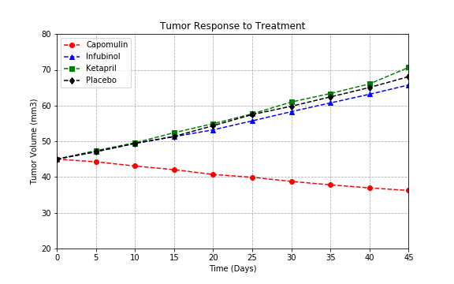
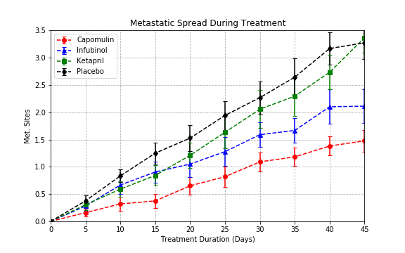
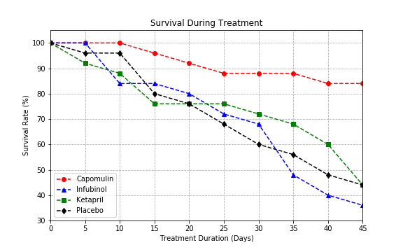
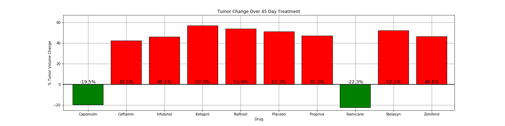

# Observable Trends
###### 1. Out of the 10 drugs tested in the clinical trial, only 2 showed positive results. Both Capomulin and Ramicane reduced tumor volume over 45 days of treatment.
###### 2. Some metastatic spread rates were lower than than others. Overall, some drugs can help reduce metastasis.
###### 3. All drugs had positive percent change in volume except Capomulin and Ramicane. Capomulin had an average of -19.5% change in volume and Ramican had an average of -22.3%.


```python
# Import dependencies
import pandas as pd
import numpy as np
import matplotlib.pyplot as plt
```


```python
# Set csv paths
trial_path = 'raw_data/clinicaltrial_data.csv'
drug_path = 'raw_data/mouse_drug_data.csv'
```


```python
# Read trial csv
trial_df = pd.read_csv(trial_path)
trial_df.head()
```


<div>
<style>
    .dataframe thead tr:only-child th {
        text-align: right;
    }

    .dataframe thead th {
        text-align: left;
    }

    .dataframe tbody tr th {
        vertical-align: top;
    }
</style>
<table border="1" class="dataframe">
  <thead>
    <tr style="text-align: right;">
      <th></th>
      <th>Mouse ID</th>
      <th>Timepoint</th>
      <th>Tumor Volume (mm3)</th>
      <th>Metastatic Sites</th>
    </tr>
  </thead>
  <tbody>
    <tr>
      <th>0</th>
      <td>b128</td>
      <td>0</td>
      <td>45.0</td>
      <td>0</td>
    </tr>
    <tr>
      <th>1</th>
      <td>f932</td>
      <td>0</td>
      <td>45.0</td>
      <td>0</td>
    </tr>
    <tr>
      <th>2</th>
      <td>g107</td>
      <td>0</td>
      <td>45.0</td>
      <td>0</td>
    </tr>
    <tr>
      <th>3</th>
      <td>a457</td>
      <td>0</td>
      <td>45.0</td>
      <td>0</td>
    </tr>
    <tr>
      <th>4</th>
      <td>c819</td>
      <td>0</td>
      <td>45.0</td>
      <td>0</td>
    </tr>
  </tbody>
</table>
</div>


```python
trial_df.count()
```


    Mouse ID              1893
    Timepoint             1893
    Tumor Volume (mm3)    1893
    Metastatic Sites      1893
    dtype: int64


```python
# Check duplicate mouse
mouse_id_index = trial_df.set_index(['Mouse ID'])
mouse_check = mouse_id_index.loc['g989',:]
mouse_check
```


<div>
<style>
    .dataframe thead tr:only-child th {
        text-align: right;
    }

    .dataframe thead th {
        text-align: left;
    }

    .dataframe tbody tr th {
        vertical-align: top;
    }
</style>
<table border="1" class="dataframe">
  <thead>
    <tr style="text-align: right;">
      <th></th>
      <th>Timepoint</th>
      <th>Tumor Volume (mm3)</th>
      <th>Metastatic Sites</th>
    </tr>
    <tr>
      <th>Mouse ID</th>
      <th></th>
      <th></th>
      <th></th>
    </tr>
  </thead>
  <tbody>
    <tr>
      <th>g989</th>
      <td>0</td>
      <td>45.000000</td>
      <td>0</td>
    </tr>
    <tr>
      <th>g989</th>
      <td>0</td>
      <td>45.000000</td>
      <td>0</td>
    </tr>
    <tr>
      <th>g989</th>
      <td>5</td>
      <td>48.786801</td>
      <td>0</td>
    </tr>
    <tr>
      <th>g989</th>
      <td>5</td>
      <td>47.570392</td>
      <td>0</td>
    </tr>
    <tr>
      <th>g989</th>
      <td>10</td>
      <td>51.745156</td>
      <td>0</td>
    </tr>
    <tr>
      <th>g989</th>
      <td>10</td>
      <td>49.880528</td>
      <td>0</td>
    </tr>
    <tr>
      <th>g989</th>
      <td>15</td>
      <td>51.325852</td>
      <td>1</td>
    </tr>
    <tr>
      <th>g989</th>
      <td>15</td>
      <td>53.442020</td>
      <td>0</td>
    </tr>
    <tr>
      <th>g989</th>
      <td>20</td>
      <td>55.326122</td>
      <td>1</td>
    </tr>
    <tr>
      <th>g989</th>
      <td>20</td>
      <td>54.657650</td>
      <td>1</td>
    </tr>
    <tr>
      <th>g989</th>
      <td>25</td>
      <td>56.045564</td>
      <td>1</td>
    </tr>
    <tr>
      <th>g989</th>
      <td>30</td>
      <td>59.082294</td>
      <td>1</td>
    </tr>
    <tr>
      <th>g989</th>
      <td>35</td>
      <td>62.570880</td>
      <td>2</td>
    </tr>
  </tbody>
</table>
</div>


```python
# Will decide to assign a new id to duplicate, check indices
trial_df.index[trial_df['Mouse ID'] == 'g989'].tolist()
```


    [107, 137, 329, 360, 620, 681, 815, 869, 950, 1111, 1195, 1380, 1592]


```python
# Assign new mouse id to duplicate
trial_df.set_value([137, 360, 681, 869, 1111], 'Mouse ID', 'g989-1')

# Not sure which drug was administered to which mouse based on these values, need to check data
# 107, 329, 620, 815, 950, 1195, 1380, 1592

# Check new mouse id at indices
trial_df['Mouse ID'][[137, 360, 681, 869, 1111]]
```


    137     g989-1
    360     g989-1
    681     g989-1
    869     g989-1
    1111    g989-1
    Name: Mouse ID, dtype: object


```python
# Read drug csv
drug_df = pd.read_csv(drug_path)
drug_df.head()
```


<div>
<style>
    .dataframe thead tr:only-child th {
        text-align: right;
    }

    .dataframe thead th {
        text-align: left;
    }

    .dataframe tbody tr th {
        vertical-align: top;
    }
</style>
<table border="1" class="dataframe">
  <thead>
    <tr style="text-align: right;">
      <th></th>
      <th>Mouse ID</th>
      <th>Drug</th>
    </tr>
  </thead>
  <tbody>
    <tr>
      <th>0</th>
      <td>f234</td>
      <td>Stelasyn</td>
    </tr>
    <tr>
      <th>1</th>
      <td>x402</td>
      <td>Stelasyn</td>
    </tr>
    <tr>
      <th>2</th>
      <td>a492</td>
      <td>Stelasyn</td>
    </tr>
    <tr>
      <th>3</th>
      <td>w540</td>
      <td>Stelasyn</td>
    </tr>
    <tr>
      <th>4</th>
      <td>v764</td>
      <td>Stelasyn</td>
    </tr>
  </tbody>
</table>
</div>


```python
drug_df.count()
```


    Mouse ID    250
    Drug        250
    dtype: int64


```python
# Check duplicate mouse
drug_df[drug_df['Mouse ID'].duplicated(keep=False)]
```


<div>
<style>
    .dataframe thead tr:only-child th {
        text-align: right;
    }

    .dataframe thead th {
        text-align: left;
    }

    .dataframe tbody tr th {
        vertical-align: top;
    }
</style>
<table border="1" class="dataframe">
  <thead>
    <tr style="text-align: right;">
      <th></th>
      <th>Mouse ID</th>
      <th>Drug</th>
    </tr>
  </thead>
  <tbody>
    <tr>
      <th>7</th>
      <td>g989</td>
      <td>Stelasyn</td>
    </tr>
    <tr>
      <th>173</th>
      <td>g989</td>
      <td>Propriva</td>
    </tr>
  </tbody>
</table>
</div>


```python
# Will decide to assign a new id to duplicate
drug_df.set_value(173, 'Mouse ID', 'g989-1')

# Check changed mouse
drug_df['Mouse ID'][173]
```


    'g989-1'


```python
# Merge trail and drug dataframes
pyma_df = pd.merge(trial_df, drug_df, how='left')
pyma_df.head()
```


<div>
<style>
    .dataframe thead tr:only-child th {
        text-align: right;
    }

    .dataframe thead th {
        text-align: left;
    }

    .dataframe tbody tr th {
        vertical-align: top;
    }
</style>
<table border="1" class="dataframe">
  <thead>
    <tr style="text-align: right;">
      <th></th>
      <th>Mouse ID</th>
      <th>Timepoint</th>
      <th>Tumor Volume (mm3)</th>
      <th>Metastatic Sites</th>
      <th>Drug</th>
    </tr>
  </thead>
  <tbody>
    <tr>
      <th>0</th>
      <td>b128</td>
      <td>0</td>
      <td>45.0</td>
      <td>0</td>
      <td>Capomulin</td>
    </tr>
    <tr>
      <th>1</th>
      <td>f932</td>
      <td>0</td>
      <td>45.0</td>
      <td>0</td>
      <td>Ketapril</td>
    </tr>
    <tr>
      <th>2</th>
      <td>g107</td>
      <td>0</td>
      <td>45.0</td>
      <td>0</td>
      <td>Ketapril</td>
    </tr>
    <tr>
      <th>3</th>
      <td>a457</td>
      <td>0</td>
      <td>45.0</td>
      <td>0</td>
      <td>Ketapril</td>
    </tr>
    <tr>
      <th>4</th>
      <td>c819</td>
      <td>0</td>
      <td>45.0</td>
      <td>0</td>
      <td>Ketapril</td>
    </tr>
  </tbody>
</table>
</div>


```python
# Check count
pyma_df.count()
```


    Mouse ID              1893
    Timepoint             1893
    Tumor Volume (mm3)    1893
    Metastatic Sites      1893
    Drug                  1893
    dtype: int64


```python
# Check duplicate mouse
mouse_id_index = pyma_df.set_index(['Mouse ID'])
mouse_check = mouse_id_index.loc['g989-1',:]
mouse_check
```


<div>
<style>
    .dataframe thead tr:only-child th {
        text-align: right;
    }

    .dataframe thead th {
        text-align: left;
    }

    .dataframe tbody tr th {
        vertical-align: top;
    }
</style>
<table border="1" class="dataframe">
  <thead>
    <tr style="text-align: right;">
      <th></th>
      <th>Timepoint</th>
      <th>Tumor Volume (mm3)</th>
      <th>Metastatic Sites</th>
      <th>Drug</th>
    </tr>
    <tr>
      <th>Mouse ID</th>
      <th></th>
      <th></th>
      <th></th>
      <th></th>
    </tr>
  </thead>
  <tbody>
    <tr>
      <th>g989-1</th>
      <td>0</td>
      <td>45.000000</td>
      <td>0</td>
      <td>Propriva</td>
    </tr>
    <tr>
      <th>g989-1</th>
      <td>5</td>
      <td>47.570392</td>
      <td>0</td>
      <td>Propriva</td>
    </tr>
    <tr>
      <th>g989-1</th>
      <td>10</td>
      <td>49.880528</td>
      <td>0</td>
      <td>Propriva</td>
    </tr>
    <tr>
      <th>g989-1</th>
      <td>15</td>
      <td>53.442020</td>
      <td>0</td>
      <td>Propriva</td>
    </tr>
    <tr>
      <th>g989-1</th>
      <td>20</td>
      <td>54.657650</td>
      <td>1</td>
      <td>Propriva</td>
    </tr>
  </tbody>
</table>
</div>


# Tumor Response to Treatment


```python
# Group by drug and timepoint
group_drug_time = pyma_df.groupby(['Drug', 'Timepoint'])

# Grab mean tumor volume
mean_tumor = group_drug_time['Tumor Volume (mm3)'].mean()

# Create dataframe from groupby object
tumor_resp_treat = pd.DataFrame({'Tumor Volume (mm3)': mean_tumor})
tumor_resp_treat.head()
```


<div>
<style>
    .dataframe thead tr:only-child th {
        text-align: right;
    }

    .dataframe thead th {
        text-align: left;
    }

    .dataframe tbody tr th {
        vertical-align: top;
    }
</style>
<table border="1" class="dataframe">
  <thead>
    <tr style="text-align: right;">
      <th></th>
      <th></th>
      <th>Tumor Volume (mm3)</th>
    </tr>
    <tr>
      <th>Drug</th>
      <th>Timepoint</th>
      <th></th>
    </tr>
  </thead>
  <tbody>
    <tr>
      <th rowspan="5" valign="top">Capomulin</th>
      <th>0</th>
      <td>45.000000</td>
    </tr>
    <tr>
      <th>5</th>
      <td>44.266086</td>
    </tr>
    <tr>
      <th>10</th>
      <td>43.084291</td>
    </tr>
    <tr>
      <th>15</th>
      <td>42.064317</td>
    </tr>
    <tr>
      <th>20</th>
      <td>40.716325</td>
    </tr>
  </tbody>
</table>
</div>


```python
# Group by drug and timepoint
group_time_drug = pyma_df.groupby(['Timepoint', 'Drug'])

# Grab mean tumor volumes
mean_tumor = group_time_drug['Tumor Volume (mm3)'].mean()

# unstack by timepoint
unstack_tumor = mean_tumor.unstack()
unstack_tumor
```


<div>
<style>
    .dataframe thead tr:only-child th {
        text-align: right;
    }

    .dataframe thead th {
        text-align: left;
    }

    .dataframe tbody tr th {
        vertical-align: top;
    }
</style>
<table border="1" class="dataframe">
  <thead>
    <tr style="text-align: right;">
      <th>Drug</th>
      <th>Capomulin</th>
      <th>Ceftamin</th>
      <th>Infubinol</th>
      <th>Ketapril</th>
      <th>Naftisol</th>
      <th>Placebo</th>
      <th>Propriva</th>
      <th>Ramicane</th>
      <th>Stelasyn</th>
      <th>Zoniferol</th>
    </tr>
    <tr>
      <th>Timepoint</th>
      <th></th>
      <th></th>
      <th></th>
      <th></th>
      <th></th>
      <th></th>
      <th></th>
      <th></th>
      <th></th>
      <th></th>
    </tr>
  </thead>
  <tbody>
    <tr>
      <th>0</th>
      <td>45.000000</td>
      <td>45.000000</td>
      <td>45.000000</td>
      <td>45.000000</td>
      <td>45.000000</td>
      <td>45.000000</td>
      <td>45.000000</td>
      <td>45.000000</td>
      <td>45.000000</td>
      <td>45.000000</td>
    </tr>
    <tr>
      <th>5</th>
      <td>44.266086</td>
      <td>46.503051</td>
      <td>47.062001</td>
      <td>47.389175</td>
      <td>46.796098</td>
      <td>47.125589</td>
      <td>47.184891</td>
      <td>43.944859</td>
      <td>47.525662</td>
      <td>46.851818</td>
    </tr>
    <tr>
      <th>10</th>
      <td>43.084291</td>
      <td>48.285125</td>
      <td>49.403909</td>
      <td>49.582269</td>
      <td>48.694210</td>
      <td>49.423329</td>
      <td>48.981377</td>
      <td>42.531957</td>
      <td>49.444904</td>
      <td>48.689881</td>
    </tr>
    <tr>
      <th>15</th>
      <td>42.064317</td>
      <td>50.094055</td>
      <td>51.296397</td>
      <td>52.399974</td>
      <td>50.933018</td>
      <td>51.359742</td>
      <td>51.051160</td>
      <td>41.495061</td>
      <td>51.442472</td>
      <td>50.779059</td>
    </tr>
    <tr>
      <th>20</th>
      <td>40.716325</td>
      <td>52.157049</td>
      <td>53.197691</td>
      <td>54.920935</td>
      <td>53.644087</td>
      <td>54.364417</td>
      <td>53.223026</td>
      <td>40.238325</td>
      <td>54.037882</td>
      <td>53.170334</td>
    </tr>
    <tr>
      <th>25</th>
      <td>39.939528</td>
      <td>54.287674</td>
      <td>55.715252</td>
      <td>57.678982</td>
      <td>56.731968</td>
      <td>57.482574</td>
      <td>55.462490</td>
      <td>38.974300</td>
      <td>56.166123</td>
      <td>55.432935</td>
    </tr>
    <tr>
      <th>30</th>
      <td>38.769339</td>
      <td>56.769517</td>
      <td>58.299397</td>
      <td>60.994507</td>
      <td>59.559509</td>
      <td>59.809063</td>
      <td>58.122548</td>
      <td>38.703137</td>
      <td>59.826738</td>
      <td>57.713531</td>
    </tr>
    <tr>
      <th>35</th>
      <td>37.816839</td>
      <td>58.827548</td>
      <td>60.742461</td>
      <td>63.371686</td>
      <td>62.685087</td>
      <td>62.420615</td>
      <td>60.103457</td>
      <td>37.451996</td>
      <td>62.440699</td>
      <td>60.089372</td>
    </tr>
    <tr>
      <th>40</th>
      <td>36.958001</td>
      <td>61.467895</td>
      <td>63.162824</td>
      <td>66.068580</td>
      <td>65.600754</td>
      <td>65.052675</td>
      <td>63.045537</td>
      <td>36.574081</td>
      <td>65.356386</td>
      <td>62.916692</td>
    </tr>
    <tr>
      <th>45</th>
      <td>36.236114</td>
      <td>64.132421</td>
      <td>65.755562</td>
      <td>70.662958</td>
      <td>69.265506</td>
      <td>68.084082</td>
      <td>66.258529</td>
      <td>34.955595</td>
      <td>68.438310</td>
      <td>65.960888</td>
    </tr>
  </tbody>
</table>
</div>


```python
# Grab sem tumor volume
sem_tumor = group_time_drug['Tumor Volume (mm3)'].sem()

# unstack by timepoint
unstack_sem_tumor = sem_tumor.unstack()
```


```python
# Create x and y axes
time = np.arange(0, 50, 5)
capomulin = unstack_tumor['Capomulin']
infubinol = unstack_tumor['Infubinol']
ketapril = unstack_tumor['Ketapril']
placebo = unstack_tumor['Placebo']

# Set figure size
plt.figure(figsize=(8, 5))

# Plot the charts and apply some styling
# cap_tum, = plt.plot(time, capomulin, color="red", marker='o', linestyle='--', label="Capomulin")
# inf_tum, = plt.plot(time, infubinol, color="blue", marker='^', linestyle='--', label="Infubinol")
# ket_tum, = plt.plot(time, ketapril, color="green", marker='s', linestyle='--', label="Ketapril")
# pla_tum, = plt.plot(time, placebo, color="black", marker='d', linestyle='--', label="Placebo")

# Create x and y axes for error bars
sem_capomulin = unstack_sem_tumor['Capomulin']
sem_infubinol = unstack_sem_tumor['Infubinol']
sem_ketapril = unstack_sem_tumor['Ketapril']
sem_placebo = unstack_sem_tumor['Placebo']

# Plot standard error bars
cap_tum = plt.errorbar(time, capomulin, yerr=sem_capomulin, fmt="o", color="red",
                       capsize=3, linestyle='--', alpha=1, label="Capomulin")
inf_tum = plt.errorbar(time, infubinol, yerr=sem_infubinol, fmt="^", color="blue", 
                       capsize=3, linestyle='--', alpha=1, label="Infubinol")
ket_tum = plt.errorbar(time, ketapril, yerr=sem_ketapril, fmt="s", color="green", 
                       capsize=3, linestyle='--', alpha=1, label="Ketapril")
pla_tum = plt.errorbar(time, placebo, yerr=sem_placebo, fmt="d", color="black", 
                       capsize=3, linestyle='--', alpha=1, label="Placebo")

# Set the limits for the X and Y axes
plt.xlim(0,45)
plt.ylim(20,80)

# Add in a grid for the chart
ax = plt.gca()
ax.grid(linestyle='--')

# Add title, x and y axes labels
plt.title("Tumor Response to Treatment")
plt.xlabel("Time (Days)")
plt.ylabel("Tumor Volume (mm3)")

# Create legend
plt.legend(handles=[cap_tum, inf_tum, ket_tum, pla_tum], loc="best")

# Tumor Response to Treatment
plt.savefig('images/tumorVolume.png')
plt.show()
```





# Metastatic Response to Treatment


```python
# Group by drug and timepoint
group_drug_time = pyma_df.groupby(['Drug', 'Timepoint'])

# Grab mean metastatic sites
mean_meta = group_drug_time['Metastatic Sites'].mean()

# Create dataframe from groupby object
meta_resp_treat = pd.DataFrame({'Metastatic Sites': mean_meta})
meta_resp_treat.head()
```


<div>
<style>
    .dataframe thead tr:only-child th {
        text-align: right;
    }

    .dataframe thead th {
        text-align: left;
    }

    .dataframe tbody tr th {
        vertical-align: top;
    }
</style>
<table border="1" class="dataframe">
  <thead>
    <tr style="text-align: right;">
      <th></th>
      <th></th>
      <th>Metastatic Sites</th>
    </tr>
    <tr>
      <th>Drug</th>
      <th>Timepoint</th>
      <th></th>
    </tr>
  </thead>
  <tbody>
    <tr>
      <th rowspan="5" valign="top">Capomulin</th>
      <th>0</th>
      <td>0.000000</td>
    </tr>
    <tr>
      <th>5</th>
      <td>0.160000</td>
    </tr>
    <tr>
      <th>10</th>
      <td>0.320000</td>
    </tr>
    <tr>
      <th>15</th>
      <td>0.375000</td>
    </tr>
    <tr>
      <th>20</th>
      <td>0.652174</td>
    </tr>
  </tbody>
</table>
</div>


```python
# Group by drug and timepoint
group_time_drug = pyma_df.groupby(['Timepoint', 'Drug'])

# Grab mean metastatic sites
mean_meta = group_time_drug['Metastatic Sites'].mean()

# unstack by timepoint
unstack_meta = mean_meta.unstack()
unstack_meta
```


<div>
<style>
    .dataframe thead tr:only-child th {
        text-align: right;
    }

    .dataframe thead th {
        text-align: left;
    }

    .dataframe tbody tr th {
        vertical-align: top;
    }
</style>
<table border="1" class="dataframe">
  <thead>
    <tr style="text-align: right;">
      <th>Drug</th>
      <th>Capomulin</th>
      <th>Ceftamin</th>
      <th>Infubinol</th>
      <th>Ketapril</th>
      <th>Naftisol</th>
      <th>Placebo</th>
      <th>Propriva</th>
      <th>Ramicane</th>
      <th>Stelasyn</th>
      <th>Zoniferol</th>
    </tr>
    <tr>
      <th>Timepoint</th>
      <th></th>
      <th></th>
      <th></th>
      <th></th>
      <th></th>
      <th></th>
      <th></th>
      <th></th>
      <th></th>
      <th></th>
    </tr>
  </thead>
  <tbody>
    <tr>
      <th>0</th>
      <td>0.000000</td>
      <td>0.000000</td>
      <td>0.000000</td>
      <td>0.000000</td>
      <td>0.000000</td>
      <td>0.000000</td>
      <td>0.000000</td>
      <td>0.000000</td>
      <td>0.000000</td>
      <td>0.000000</td>
    </tr>
    <tr>
      <th>5</th>
      <td>0.160000</td>
      <td>0.380952</td>
      <td>0.280000</td>
      <td>0.304348</td>
      <td>0.260870</td>
      <td>0.375000</td>
      <td>0.333333</td>
      <td>0.120000</td>
      <td>0.250000</td>
      <td>0.166667</td>
    </tr>
    <tr>
      <th>10</th>
      <td>0.320000</td>
      <td>0.600000</td>
      <td>0.666667</td>
      <td>0.590909</td>
      <td>0.523810</td>
      <td>0.833333</td>
      <td>0.590909</td>
      <td>0.250000</td>
      <td>0.500000</td>
      <td>0.500000</td>
    </tr>
    <tr>
      <th>15</th>
      <td>0.375000</td>
      <td>0.789474</td>
      <td>0.904762</td>
      <td>0.842105</td>
      <td>0.857143</td>
      <td>1.250000</td>
      <td>0.750000</td>
      <td>0.333333</td>
      <td>0.818182</td>
      <td>0.809524</td>
    </tr>
    <tr>
      <th>20</th>
      <td>0.652174</td>
      <td>1.111111</td>
      <td>1.050000</td>
      <td>1.210526</td>
      <td>1.150000</td>
      <td>1.526316</td>
      <td>1.000000</td>
      <td>0.347826</td>
      <td>0.950000</td>
      <td>1.294118</td>
    </tr>
    <tr>
      <th>25</th>
      <td>0.818182</td>
      <td>1.500000</td>
      <td>1.277778</td>
      <td>1.631579</td>
      <td>1.500000</td>
      <td>1.941176</td>
      <td>1.384615</td>
      <td>0.652174</td>
      <td>1.157895</td>
      <td>1.687500</td>
    </tr>
    <tr>
      <th>30</th>
      <td>1.090909</td>
      <td>1.937500</td>
      <td>1.588235</td>
      <td>2.055556</td>
      <td>2.066667</td>
      <td>2.266667</td>
      <td>1.666667</td>
      <td>0.782609</td>
      <td>1.388889</td>
      <td>1.933333</td>
    </tr>
    <tr>
      <th>35</th>
      <td>1.181818</td>
      <td>2.071429</td>
      <td>1.666667</td>
      <td>2.294118</td>
      <td>2.266667</td>
      <td>2.642857</td>
      <td>2.333333</td>
      <td>0.952381</td>
      <td>1.562500</td>
      <td>2.285714</td>
    </tr>
    <tr>
      <th>40</th>
      <td>1.380952</td>
      <td>2.357143</td>
      <td>2.100000</td>
      <td>2.733333</td>
      <td>2.466667</td>
      <td>3.166667</td>
      <td>2.777778</td>
      <td>1.100000</td>
      <td>1.583333</td>
      <td>2.785714</td>
    </tr>
    <tr>
      <th>45</th>
      <td>1.476190</td>
      <td>2.692308</td>
      <td>2.111111</td>
      <td>3.363636</td>
      <td>2.538462</td>
      <td>3.272727</td>
      <td>2.571429</td>
      <td>1.250000</td>
      <td>1.727273</td>
      <td>3.071429</td>
    </tr>
  </tbody>
</table>
</div>


```python
# Grab sem tumor volume
sem_meta = group_time_drug['Metastatic Sites'].sem()

# unstack by timepoint
unstack_sem_meta = sem_meta.unstack()
```


```python
# Create x and y axes
time = np.arange(0, 50, 5)
capomulin = unstack_meta['Capomulin']
infubinol = unstack_meta['Infubinol']
ketapril = unstack_meta['Ketapril']
placebo = unstack_meta['Placebo']

# Set figure size
plt.figure(figsize=(8, 5))

# Plot the charts and apply some styling
# cap_met, = plt.plot(time, capomulin, color="red", marker='o', linestyle='--', label="Capomulin")
# inf_met, = plt.plot(time, infubinol, color="blue", marker='^', linestyle='--', label="Infubinol")
# ket_met, = plt.plot(time, ketapril, color="green", marker='s', linestyle='--', label="Ketapril")
# pla_met, = plt.plot(time, placebo, color="black", marker='d', linestyle='--', label="Placebo")

# Create x and y axes for error bars
sem_capomulin = unstack_sem_meta['Capomulin']
sem_infubinol = unstack_sem_meta['Infubinol']
sem_ketapril = unstack_sem_meta['Ketapril']
sem_placebo = unstack_sem_meta['Placebo']

# Plot standard error bars
cap_met = plt.errorbar(time, capomulin, yerr=sem_capomulin, fmt="o", color="red",
                       capsize=3, linestyle='--', alpha=1, label="Capomulin")
inf_met = plt.errorbar(time, infubinol, yerr=sem_infubinol, fmt="^", color="blue", 
                       capsize=3, linestyle='--', alpha=1, label="Infubinol")
ket_met = plt.errorbar(time, ketapril, yerr=sem_ketapril, fmt="s", color="green", 
                       capsize=3, linestyle='--', alpha=1, label="Ketapril")
pla_met = plt.errorbar(time, placebo, yerr=sem_placebo, fmt="d", color="black", 
                       capsize=3, linestyle='--', alpha=1, label="Placebo")

# Set the limits for the X and Y axes
plt.xlim(0,45)
plt.ylim(0,3.5)

# Add in a grid for the chart
ax = plt.gca()
ax.grid(linestyle='--')

# Add title, x and y axes labels
plt.title("Metastatic Spread During Treatment")
plt.xlabel("Treatment Duration (Days)")
plt.ylabel("Met. Sites")

# Create legend
plt.legend(handles=[cap_met, inf_met, ket_met, pla_met], loc="best")

# Metatstatic Spread During Treatment
plt.savefig('images/metaSites.png')
plt.show()
```





# Survival Rates


```python
# Group by drug and timepoint
group_drug_time = pyma_df.groupby(['Drug', 'Timepoint'])

# Grab mean mouse count
mouse_count = group_drug_time['Mouse ID'].count()

# Create dataframe from groupby object
surv_rate = pd.DataFrame({'Mouse Count': mouse_count})
surv_rate.head()
```


<div>
<style>
    .dataframe thead tr:only-child th {
        text-align: right;
    }

    .dataframe thead th {
        text-align: left;
    }

    .dataframe tbody tr th {
        vertical-align: top;
    }
</style>
<table border="1" class="dataframe">
  <thead>
    <tr style="text-align: right;">
      <th></th>
      <th></th>
      <th>Mouse Count</th>
    </tr>
    <tr>
      <th>Drug</th>
      <th>Timepoint</th>
      <th></th>
    </tr>
  </thead>
  <tbody>
    <tr>
      <th rowspan="5" valign="top">Capomulin</th>
      <th>0</th>
      <td>25</td>
    </tr>
    <tr>
      <th>5</th>
      <td>25</td>
    </tr>
    <tr>
      <th>10</th>
      <td>25</td>
    </tr>
    <tr>
      <th>15</th>
      <td>24</td>
    </tr>
    <tr>
      <th>20</th>
      <td>23</td>
    </tr>
  </tbody>
</table>
</div>


```python
# Group by drug and timepoint
group_time_drug = pyma_df.groupby(['Timepoint', 'Drug'])

# Grab mean mouse count
mouse_count = group_time_drug['Mouse ID'].count()

# unstack by timepoint
unstack_surv = mouse_count.unstack()
unstack_surv
```


<div>
<style>
    .dataframe thead tr:only-child th {
        text-align: right;
    }

    .dataframe thead th {
        text-align: left;
    }

    .dataframe tbody tr th {
        vertical-align: top;
    }
</style>
<table border="1" class="dataframe">
  <thead>
    <tr style="text-align: right;">
      <th>Drug</th>
      <th>Capomulin</th>
      <th>Ceftamin</th>
      <th>Infubinol</th>
      <th>Ketapril</th>
      <th>Naftisol</th>
      <th>Placebo</th>
      <th>Propriva</th>
      <th>Ramicane</th>
      <th>Stelasyn</th>
      <th>Zoniferol</th>
    </tr>
    <tr>
      <th>Timepoint</th>
      <th></th>
      <th></th>
      <th></th>
      <th></th>
      <th></th>
      <th></th>
      <th></th>
      <th></th>
      <th></th>
      <th></th>
    </tr>
  </thead>
  <tbody>
    <tr>
      <th>0</th>
      <td>25</td>
      <td>25</td>
      <td>25</td>
      <td>25</td>
      <td>25</td>
      <td>25</td>
      <td>25</td>
      <td>25</td>
      <td>25</td>
      <td>25</td>
    </tr>
    <tr>
      <th>5</th>
      <td>25</td>
      <td>21</td>
      <td>25</td>
      <td>23</td>
      <td>23</td>
      <td>24</td>
      <td>24</td>
      <td>25</td>
      <td>24</td>
      <td>24</td>
    </tr>
    <tr>
      <th>10</th>
      <td>25</td>
      <td>20</td>
      <td>21</td>
      <td>22</td>
      <td>21</td>
      <td>24</td>
      <td>22</td>
      <td>24</td>
      <td>22</td>
      <td>22</td>
    </tr>
    <tr>
      <th>15</th>
      <td>24</td>
      <td>19</td>
      <td>21</td>
      <td>19</td>
      <td>21</td>
      <td>20</td>
      <td>16</td>
      <td>24</td>
      <td>22</td>
      <td>21</td>
    </tr>
    <tr>
      <th>20</th>
      <td>23</td>
      <td>18</td>
      <td>20</td>
      <td>19</td>
      <td>20</td>
      <td>19</td>
      <td>16</td>
      <td>23</td>
      <td>20</td>
      <td>17</td>
    </tr>
    <tr>
      <th>25</th>
      <td>22</td>
      <td>18</td>
      <td>18</td>
      <td>19</td>
      <td>18</td>
      <td>17</td>
      <td>13</td>
      <td>23</td>
      <td>19</td>
      <td>16</td>
    </tr>
    <tr>
      <th>30</th>
      <td>22</td>
      <td>16</td>
      <td>17</td>
      <td>18</td>
      <td>15</td>
      <td>15</td>
      <td>12</td>
      <td>23</td>
      <td>18</td>
      <td>15</td>
    </tr>
    <tr>
      <th>35</th>
      <td>22</td>
      <td>14</td>
      <td>12</td>
      <td>17</td>
      <td>15</td>
      <td>14</td>
      <td>9</td>
      <td>21</td>
      <td>16</td>
      <td>14</td>
    </tr>
    <tr>
      <th>40</th>
      <td>21</td>
      <td>14</td>
      <td>10</td>
      <td>15</td>
      <td>15</td>
      <td>12</td>
      <td>9</td>
      <td>20</td>
      <td>12</td>
      <td>14</td>
    </tr>
    <tr>
      <th>45</th>
      <td>21</td>
      <td>13</td>
      <td>9</td>
      <td>11</td>
      <td>13</td>
      <td>11</td>
      <td>7</td>
      <td>20</td>
      <td>11</td>
      <td>14</td>
    </tr>
  </tbody>
</table>
</div>


```python
# Create x and y axes
time = np.arange(0, 50, 5)
capomulin = unstack_surv['Capomulin']/25*100
infubinol = unstack_surv['Infubinol']/25*100
ketapril = unstack_surv['Ketapril']/25*100
placebo = unstack_surv['Placebo']/25*100

# Set figure size
plt.figure(figsize=(8, 5))

# Plot the charts and apply some styling
cap_surv, = plt.plot(time, capomulin, color="red", marker='o', linestyle='--', label="Capomulin")
inf_surv, = plt.plot(time, infubinol, color="blue", marker='^', linestyle='--', label="Infubinol")
ket_surv, = plt.plot(time, ketapril, color="green", marker='s', linestyle='--', label="Ketapril")
pla_surv, = plt.plot(time, placebo, color="black", marker='d', linestyle='--', label="Placebo")

# Set the limits for the X and Y axes
plt.xlim(0,45)
plt.ylim(30,105)

# Add gridlines
ax = plt.gca()
ax.grid(linestyle='--')

# Add title, x and y axes labels
plt.title("Survival During Treatment")
plt.xlabel("Treatment Duration (Days)")
plt.ylabel("Survival Rate (%)")

# Create legend
plt.legend(handles=[cap_surv, inf_surv, ket_surv, pla_surv], loc="lower left")

# Survial During Treatment
plt.savefig('images/survRate.png')
plt.show()
```





# Summary Bar Graph


```python
# Check unstack tumor dataframe
unstack_tumor
```


<div>
<style>
    .dataframe thead tr:only-child th {
        text-align: right;
    }

    .dataframe thead th {
        text-align: left;
    }

    .dataframe tbody tr th {
        vertical-align: top;
    }
</style>
<table border="1" class="dataframe">
  <thead>
    <tr style="text-align: right;">
      <th>Drug</th>
      <th>Capomulin</th>
      <th>Ceftamin</th>
      <th>Infubinol</th>
      <th>Ketapril</th>
      <th>Naftisol</th>
      <th>Placebo</th>
      <th>Propriva</th>
      <th>Ramicane</th>
      <th>Stelasyn</th>
      <th>Zoniferol</th>
    </tr>
    <tr>
      <th>Timepoint</th>
      <th></th>
      <th></th>
      <th></th>
      <th></th>
      <th></th>
      <th></th>
      <th></th>
      <th></th>
      <th></th>
      <th></th>
    </tr>
  </thead>
  <tbody>
    <tr>
      <th>0</th>
      <td>45.000000</td>
      <td>45.000000</td>
      <td>45.000000</td>
      <td>45.000000</td>
      <td>45.000000</td>
      <td>45.000000</td>
      <td>45.000000</td>
      <td>45.000000</td>
      <td>45.000000</td>
      <td>45.000000</td>
    </tr>
    <tr>
      <th>5</th>
      <td>44.266086</td>
      <td>46.503051</td>
      <td>47.062001</td>
      <td>47.389175</td>
      <td>46.796098</td>
      <td>47.125589</td>
      <td>47.184891</td>
      <td>43.944859</td>
      <td>47.525662</td>
      <td>46.851818</td>
    </tr>
    <tr>
      <th>10</th>
      <td>43.084291</td>
      <td>48.285125</td>
      <td>49.403909</td>
      <td>49.582269</td>
      <td>48.694210</td>
      <td>49.423329</td>
      <td>48.981377</td>
      <td>42.531957</td>
      <td>49.444904</td>
      <td>48.689881</td>
    </tr>
    <tr>
      <th>15</th>
      <td>42.064317</td>
      <td>50.094055</td>
      <td>51.296397</td>
      <td>52.399974</td>
      <td>50.933018</td>
      <td>51.359742</td>
      <td>51.051160</td>
      <td>41.495061</td>
      <td>51.442472</td>
      <td>50.779059</td>
    </tr>
    <tr>
      <th>20</th>
      <td>40.716325</td>
      <td>52.157049</td>
      <td>53.197691</td>
      <td>54.920935</td>
      <td>53.644087</td>
      <td>54.364417</td>
      <td>53.223026</td>
      <td>40.238325</td>
      <td>54.037882</td>
      <td>53.170334</td>
    </tr>
    <tr>
      <th>25</th>
      <td>39.939528</td>
      <td>54.287674</td>
      <td>55.715252</td>
      <td>57.678982</td>
      <td>56.731968</td>
      <td>57.482574</td>
      <td>55.462490</td>
      <td>38.974300</td>
      <td>56.166123</td>
      <td>55.432935</td>
    </tr>
    <tr>
      <th>30</th>
      <td>38.769339</td>
      <td>56.769517</td>
      <td>58.299397</td>
      <td>60.994507</td>
      <td>59.559509</td>
      <td>59.809063</td>
      <td>58.122548</td>
      <td>38.703137</td>
      <td>59.826738</td>
      <td>57.713531</td>
    </tr>
    <tr>
      <th>35</th>
      <td>37.816839</td>
      <td>58.827548</td>
      <td>60.742461</td>
      <td>63.371686</td>
      <td>62.685087</td>
      <td>62.420615</td>
      <td>60.103457</td>
      <td>37.451996</td>
      <td>62.440699</td>
      <td>60.089372</td>
    </tr>
    <tr>
      <th>40</th>
      <td>36.958001</td>
      <td>61.467895</td>
      <td>63.162824</td>
      <td>66.068580</td>
      <td>65.600754</td>
      <td>65.052675</td>
      <td>63.045537</td>
      <td>36.574081</td>
      <td>65.356386</td>
      <td>62.916692</td>
    </tr>
    <tr>
      <th>45</th>
      <td>36.236114</td>
      <td>64.132421</td>
      <td>65.755562</td>
      <td>70.662958</td>
      <td>69.265506</td>
      <td>68.084082</td>
      <td>66.258529</td>
      <td>34.955595</td>
      <td>68.438310</td>
      <td>65.960888</td>
    </tr>
  </tbody>
</table>
</div>


```python
# Grab final tumor size
final_tumor_size = unstack_tumor.iloc[9,[0, 1, 2, 3, 4, 5, 6, 7, 8, 9]]
final_tumor_size
```


    Drug
    Capomulin    36.236114
    Ceftamin     64.132421
    Infubinol    65.755562
    Ketapril     70.662958
    Naftisol     69.265506
    Placebo      68.084082
    Propriva     66.258529
    Ramicane     34.955595
    Stelasyn     68.438310
    Zoniferol    65.960888
    Name: 45, dtype: float64


```python
# Create dataframe
tum_vol_chg = pd.DataFrame(final_tumor_size)

# Rename column
tum_vol_chg = tum_vol_chg.rename(columns={45: 'Final Tumor Size'})

# Calculate percent change and add to dataframe
tum_vol_chg['% Tumor Volume Change'] = (tum_vol_chg['Final Tumor Size'] - 45)/45*100

# Drop final tumor size column
tum_vol_chg = tum_vol_chg.drop('Final Tumor Size', axis=1)

# Add if positive column for bar chart coloring
tum_vol_chg['Positive?'] = tum_vol_chg['% Tumor Volume Change'] > 0
tum_vol_chg
```


<div>
<style>
    .dataframe thead tr:only-child th {
        text-align: right;
    }

    .dataframe thead th {
        text-align: left;
    }

    .dataframe tbody tr th {
        vertical-align: top;
    }
</style>
<table border="1" class="dataframe">
  <thead>
    <tr style="text-align: right;">
      <th></th>
      <th>% Tumor Volume Change</th>
      <th>Positive?</th>
    </tr>
    <tr>
      <th>Drug</th>
      <th></th>
      <th></th>
    </tr>
  </thead>
  <tbody>
    <tr>
      <th>Capomulin</th>
      <td>-19.475303</td>
      <td>False</td>
    </tr>
    <tr>
      <th>Ceftamin</th>
      <td>42.516492</td>
      <td>True</td>
    </tr>
    <tr>
      <th>Infubinol</th>
      <td>46.123472</td>
      <td>True</td>
    </tr>
    <tr>
      <th>Ketapril</th>
      <td>57.028795</td>
      <td>True</td>
    </tr>
    <tr>
      <th>Naftisol</th>
      <td>53.923347</td>
      <td>True</td>
    </tr>
    <tr>
      <th>Placebo</th>
      <td>51.297960</td>
      <td>True</td>
    </tr>
    <tr>
      <th>Propriva</th>
      <td>47.241175</td>
      <td>True</td>
    </tr>
    <tr>
      <th>Ramicane</th>
      <td>-22.320900</td>
      <td>False</td>
    </tr>
    <tr>
      <th>Stelasyn</th>
      <td>52.085134</td>
      <td>True</td>
    </tr>
    <tr>
      <th>Zoniferol</th>
      <td>46.579751</td>
      <td>True</td>
    </tr>
  </tbody>
</table>
</div>


```python
# Create list of % tumor volume change of several drugs
drugs = [tum_vol_chg['% Tumor Volume Change'][0], tum_vol_chg['% Tumor Volume Change'][1], 
         tum_vol_chg['% Tumor Volume Change'][2], tum_vol_chg['% Tumor Volume Change'][3], 
         tum_vol_chg['% Tumor Volume Change'][4], tum_vol_chg['% Tumor Volume Change'][5], 
         tum_vol_chg['% Tumor Volume Change'][6], tum_vol_chg['% Tumor Volume Change'][7], 
         tum_vol_chg['% Tumor Volume Change'][8], tum_vol_chg['% Tumor Volume Change'][9]]
x_axis = np.arange(len(drugs))

# Set figure size
plt.figure(figsize=(20, 5))

# Plot bars
tum_bar = plt.bar(x_axis, drugs, color=tum_vol_chg['Positive?'].map({True: 'r', False: 'g'}), 
                  edgecolor='black', alpha=1, align="edge")

# Place tick locations and label
tick_locations = [value+0.4 for value in x_axis]
plt.xticks(tick_locations, ["Capomulin", "Ceftamin", "Infubinol", "Ketapril", "Naftisol", 
                            "Placebo", "Propriva", "Ramicane", "Stelasyn", "Zoniferol"])

# Set the x and y limits
plt.xlim(-0.25, len(x_axis))
plt.ylim(-25, max(drugs)+10)

# Draw horizontal line
plt.axhline(y=0, xmin=0, xmax=1, linestyle='-', color='black')

# Give our chart some labels and a tile
plt.title("Tumor Change Over 45 Day Treatment")
plt.xlabel("Drug")
plt.ylabel("% Tumor Volume Change")

# Insert grid lines and set behind plot elements
ax = plt.gca()
ax.grid(linestyle='--')
ax.grid(color='black', alpha=0.7)
ax.set_axisbelow(True)

# Annotate bars
perc_tum_vol_chg = [f'{chg:.1f}%' for chg in drugs]
for i, rect in enumerate(tum_bar):
    height = 0
    plt.text(rect.get_x() + rect.get_width()/2.0, height, perc_tum_vol_chg[i], 
             color='black', fontsize='13', ha='center', va='bottom')

# Tumor Change Over 45 Day Treatment
plt.savefig('images/percTumorChange.png')
plt.show()
```




